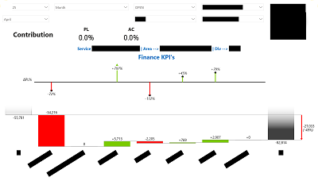
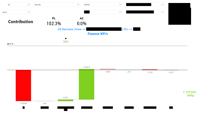
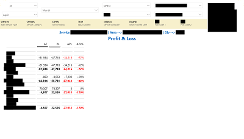
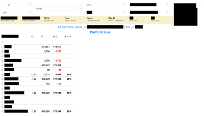

# Hi, I'm Michael Glynn

I'm a Data Analyst with a focus on Power BI, DAX, and visual storytelling.  
This site showcases selected work across financial reporting, education analytics, and dashboard design.

[📄 View Resume](./resume-michael-glynn.pdf) • [💻 GitHub](https://github.com/michaelglynn-PROJECT-REPO)

---

## About

This curated portfolio showcases Power BI projects I've built across various sectors, highlighting advanced data visualization, custom DAX logic, and performance-tuned reporting.  
Projects include:
- Migrating Zebra BI visuals to native Power BI for financial reporting
- Designing rich educational dashboards for college-wide insight
- Creating smart matrix tables, waterfall visuals, and dynamic drillthrough logic

I'm currently completing a Data Analyst apprenticeship with **Cambridge Spark**, expected to finish in February 2026.

---

## Skills

Power BI · DAX · SQL · UX Design · Data Modeling · Report Optimization

---

## Projects

### ZebraBI to PowerBI Migration

| Before | After |
|--------|-------|
|  |  |
|  |  |

_A fully native Power BI replacement of ZebraBI visuals, including matrix logic, custom tooltips, and optimized visuals._

👉 [View Full Project →](./projects/finance-zebrabi/)

---

### Education Dashboard (ROC)

Coming soon — a data-rich visual dashboard project focused on student performance, enrolment trends, and dropout detection.

👉 [View Project](./projects/mis-dashboard)

---

## Contact

_© 2025 Michael Glynn_  
[Connect vua LinkedIn](https://linkedin.com/in/michael-glynn-81609b175) • [Connect via Email](mailto:michaelglynn@hotmail.com)
