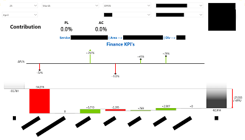
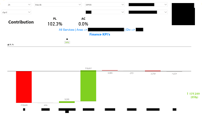
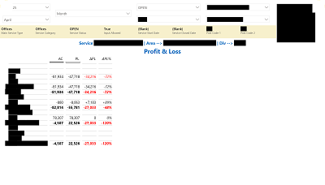
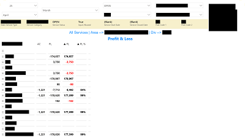
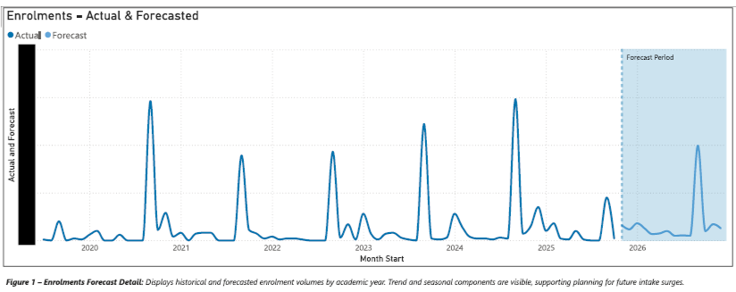
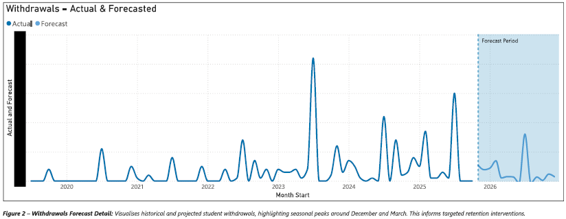

# Hi, I'm Michael Glynn

I'm a Data Analyst with a focus on Power BI, Python, forecasting, and visual storytelling.  
This site showcases selected work across financial reporting, predictive modelling, and education analytics.

[📄 View Resume](./resume-michael-glynn.pdf) • [💻 GitHub](https://github.com/michaelglynn-PROJECT-REPO)

---

## About

This curated portfolio showcases Power BI and Python projects I've built across finance, education, and predictive analytics.  
Projects include:
- Migrating Zebra BI visuals to native Power BI for financial reporting  
- Building a Python → Power BI forecasting pipeline using Holt-Winters ETS  
- Designing rich educational dashboards and dynamic matrix layouts  
- Creating time-series models, automated SQL pipelines, and smart DAX structures

I'm currently completing a Data Analyst apprenticeship with **Cambridge Spark**, expected to finish in February 2026.

---

## Skills

Power BI · Python · Time-Series Forecasting · DAX · SQL · UX Design · Data Modeling · Report Optimization

---

## Projects

### ZebraBI to PowerBI Migration

| Before | After |
|--------|-------|
|  |  |
|  |  |

_A fully native Power BI replacement of ZebraBI visuals, including matrix logic, custom tooltips, and optimized visuals._

👉 [View Full Project →](./projects/finance-zebrabi/)

---

### Predictive Forecasting & Time-Series Analysis  
**Python + Power BI**

| Forecasting Enrolments | Forecasting Withdrawals |
|----------|--------------------|
|  |  |

_A forecasting pipeline combining Python (Holt-Winters ETS, ADF testing, RMSE scoring) with Power BI for trend analysis and scenario planning._

👉 [View Full Project →](./projects/Predictive%20Forecasting%20&%20Time-Series%20Analysis)

---

### Education Dashboard (ROC)

A data-rich Power BI dashboard focused on student performance, enrolment trends, and dropout detection (coming soon).

👉 [View Project](./projects/mis-dashboard)

---

## Contact

_© 2025 Michael Glynn_  
[Connect via LinkedIn](https://linkedin.com/in/michael-glynn-81609b175) • [Connect via Email](mailto:michaelglynn@hotmail.com)

